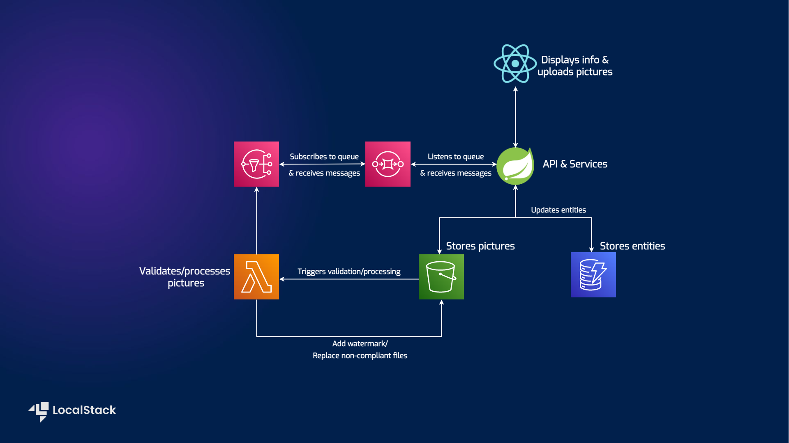

# Shipment List Demo Application - Testcontainers for Integration Tests


| Environment      |   |
|------------------|--------------------------------------------------------------------------------------------------------------------------------------------------------------------------------------------------------------------------------------------------------------------------------------------------------------------------------------------------------------------------------------------------------------------------------------------------------------------------------------------------------------------------------------------------------------------------------------------------------------------------------------------------------------------------------------------------------------------------------------------------------------------------------------------------------------------------------------------------------------------------------------------------------------------------------------------------------------------------------------------------------------------------------------------------------------------------------------------------------------------------------------------------------------------------------------------------------------------------------------------------------------------------------------------------------------------------------------------------------------------------------|
| __Services__     | Amazon S3, Lambda, DynamoDB, SNS, SQS                                                                                                                                                                                                                                                                                                                                                                                                                                                                                                                                                                                                                                                                                                                                                                                                                                                                                                                                                                                                                                                                                                                                                                                                                                                                                                                                          |
| __Integrations__ | AWS SDK, Terraform, AWS CLI                                                                                                                                                                                                                                                                                                                                                                                                                                                                                                                                                                                                                                                                                                                                                                                                                                                                                                                                                                                                                                                                                                                                                                                                                                                                                                                                                    |
| __Categories__   | Spring Boot, Testcontainers                                                                                                                                                                                                                                                                                                                                                                                                                                                                                                                                                                                                                                                                                                                                                                                                                                                                                                                                                                                                                                                                                                                                                                                                                                                                                                                                                    |
| __Level__        | Intermediate                                                                                                                                                                                                                                                                                                                                                                                                                                                                                                                                                                                                                                                                                                                                                                                                                                                                                                                                                                                                                                                                                                                                                                                                                                                                                                                                                                   |
| __Works on__     | LocalStack v2                                                                                                                                                                                                                                                                                                                                                                                                                                                                                                                                                                                                                                                                                                                                                                                                                                                                                                                                                                                                                                                                                                                                                                                                                                                                                                                                                                  |


## Introduction

This repository will be focusing on integration tests for your AWS powered application, using Testcontainers.
It is referencing another [repo](https://github.com/tinyg210/shipment-list-demo) that describes strictly
the development part, so let's move forward with the integration tests here.

The primary goal of integration tests is to uncover issues that may arise when different components 
interact with each other, such as incorrect data transfer, incompatible interfaces, communication failures,
or synchronization problems. By simulating real-world scenarios and testing the integration of various parts
of the system, these tests help us identify and resolve these issues early in the development process.


## Architecture Overview

Let's take another quick look at the app's architecture and figure out what workflows we need to test.




## Prerequisites

- [Maven 3.8.5](https://maven.apache.org/install.html) & [Java 17](https://www.java.com/en/download/help/download_options.html)
- [Docker](https://docs.docker.com/get-docker/) - for running LocalStack


#### Recap

*shipment-list-demo* is a Spring Boot application dealing with CRUD operations an employee can
execute on a bunch of shipments that they're allowed to view - think of it like the Post app.
The demo consists of a backend and a frontend implementation, using React to display the
information. The AWS services involved are:

- [S3](https://docs.localstack.cloud/user-guide/aws/s3/) for storing pictures
- [DynamoDB](https://docs.localstack.cloud/user-guide/aws/dynamodb/) for the entities
- [Lambda](https://docs.localstack.cloud/user-guide/aws/lambda/) function that will validate the pictures, apply a watermark and replace non-compliant files.
- [SNS](https://docs.localstack.cloud/user-guide/aws/sns/) that receives update notifications
- [SQS](https://docs.localstack.cloud/user-guide/aws/sqs/) that subscribes to a topic and delivers the messages to the Spring Boot app

You can refer to the original repository for instructions on how to run the application.


## Testcontainers

If you're here I'm sure you've at least heard of Testcontainers before.
Testcontainers is a popular Java library that provides lightweight, disposable containers for running 
integration tests. It allows developers to easily create and 
manage isolated environments for testing applications that require dependencies like databases, message 
brokers, web services, or other external systems.
And this is the beauty of having LocalStack ship as a Docker image, it is now an official Testcontainers module,
meaning you can easily write integration tests for your AWS powered application.

### Scenarios to be tested


According to the diagram and the API, these are some workflows that needed to be tested:
- upload a picture corresponding to a shipment and store it in the S3 bucket;
- download the picture from the S3 bucket;
- validation of the existence of the entity before uploading a picture;
- add an entity to DynamoDB;
- get the entities from DynamoDB;
- delete an entity from DynamoDB;
- Lambda function gets triggered by object upload to S3 bucket;
- Lambda function adds metadata to processed object;
- notification message traverses SNS and SQS to announce processing finished.


### Getting started

#### Configuration

The very basic configuration for your project to start using Testcontainers is 
the maven dependency itself:

```
<dependency>
  <groupId>org.testcontainers</groupId>
  <artifactId>testcontainers</artifactId>
  <version>1.18.1</version>
</dependency>
```

Testcontainers provides `modules` that simplify testing by integrating with 
test frameworks and offering optimized service containers. Each module is a
separate dependency that can be added as needed, so we'll add the `JUnit Jupiter` 
integration and a `LocalStack` container. (check the pom.xml)

#### Setup

The tests are found under the `src/test/java/dev/ancaghenade/shipmentlistdemo/integrationtests` folder.
For the sake of simplicity and having smaller iterations, the tests are split into 3 categories:

- using S3 and DynamoDB services - in `ShipmentServiceIntegrationTest` class
- using S3, DynamoDB and Lambda services - in `LambdaIntegrationTest` class
- using all (S3, DynamoDB, Lambda, SNS,& SQS) services - in `MessageReceiverIntegrationTest` class

The resources are created programmatically and have been abstracted away in `LocalStackSetupConfigurations`.
As a superclass, it is also marked with `@SpringBootTest` and `@Testcontainers` annotations.

The `@SpringBootTest` annotation allows you to load the complete Spring application context for performing the tests.
`WebEnvironment.DEFINED_PORT` is used, which means the application will be started with a real embedded web
server listening on a defined port (in this case, port 8081). You also have the option of using a random port and 
injecting it, but since there's not much conflict happening here, we'll stay with defined.

By using the `@Testcontainers` annotation, we enable a JUnit 5 extension that automatically manages the lifecycle
of containers for us. In this specific case, the lifecycle of the container is linked to the lifecycle of the test class.


The `Slf4jLogConsumer` class from Testcontainers is used to stream the output of a container to an existing 
SLF4J logger instance. By creating an instance of Slf4jLogConsumer with the logger, and then using 
`container.followOutput(logConsumer)`, the container's output, including both standard out and standard error logs, 
is redirected to the SLF4J logger. By default, these logs will be emitted at the INFO level, 
allowing you to conveniently capture and integrate container logs with your application's logging system.


In the superclass, the `overrideConfigs` method is annotated with `@DynamicPropertySource`. This annotation is 
used in integration tests with Spring Boot to dynamically override application configuration properties. 
The properties are added to the `DynamicPropertyRegistry`, which allows you to define dynamic 
properties at runtime. These properties are the ones we already know from the application, including endpoints for S3, DynamoDB, SQS, SNS, 
AWS region, and the picture bucket name. The AWS specific values are obtained from the LocalStack instance.


#### Tests

Once the application starts, the testing can begin, by using the `TestRestTemplate` to make calls to the endpoints.

`TestRestTemplate` allows you to interact with your RESTful API in integration 
tests by making HTTP requests and receiving responses. It provides a higher-level
API compared to `RestTemplate`, making it more straight forward to write your calls.

Since the lifecycle of the container is tied to the test class, we'll use the `@TestMethodOrder` annotation
to execute the tests in the order that we specify, to make the most out of the sequential workflows.

We call all the endpoints and expect to get an HTTP 200 status code, but we also need to make sure
that certain payloads will fail, so we need to check for edge cases and make sure all scenarios are covered.

#### Steps to run your tests

- Build the Lambda function:
 cd into the `shipment-picture-lambda-validator` folder and `mvn clean package shade:shade`
- Run the test classes:
from the root folder: `mvn test -Dtest=ShipmentServiceIntegrationTest`
or use your favourite IDE for a nice green stack of tests.


### Wrapping up

Working with cloud services dictates a crucial need for integration tests. To enhance the testability 
of a Spring Boot application that relies on AWS services, Testcontainers can now be utilized with LocalStack, as 
an official module. It simplifies the container configuration, lifecycle management, and clean-up process by 
leveraging the Testcontainers core libraries and modules specific features. Additionally, the `@DynamicPropertySource`
methods enable dynamic configuration of the application to use the containerized dependencies. Overall,
the combination of LocalStack and Testcontainers offers great advantages, making it effortless to start writing integration tests
for your cloud application.

#### Further reading

- Testcontainers LocalStack module - https://java.testcontainers.org/modules/localstack/
- LocalStack user guides - https://docs.localstack.cloud/user-guide/
- Testcontainers workshop - https://github.com/testcontainers/workshop


